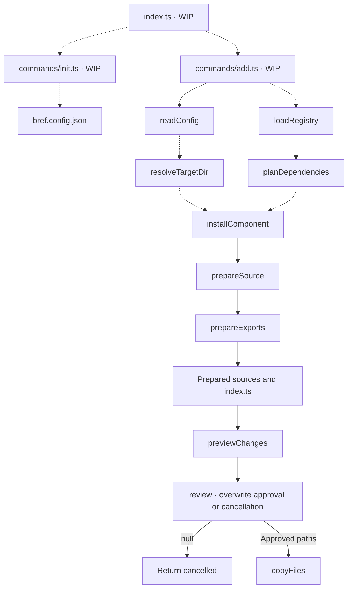

# Component CLI

The Bref CLI is being built to copy editable component source into a consumer project's
configured UI directory, using package types from `bref-ui/types`.

## Overview

This diagram shows the intended composition. Dashed arrows are wiring still to implement;
nodes marked WIP are placeholders. The named functions already exist as standalone stages.
The executable and commands are not connected yet, and CLI packaging is unfinished.



## Workflow documentation

| Directory                                | Workflows                                                | Status      |
| ---------------------------------------- | -------------------------------------------------------- | ----------- |
| [config](config/README.md)               | Read configuration; resolve the destination alias        | Implemented |
| [registry](registry/README.md)           | Plan dependencies                                        | Implemented |
| [registry/load](registry/load/README.md) | Discover and validate manifests and dependencies         | Implemented |
| [installation](installation/README.md)   | Prepare sources and exports; preview changes; copy files | Implemented |
| [installation](installation/README.md)   | Coordinate installation                                  | Implemented |
| [commands](commands/README.md)           | Route commands; initialize configuration; add components | WIP         |

## Source layout

```text
cli/
  index.ts
  commands/
    add.ts
    init.ts
  config/
    read/
      index.ts
      normalize-config.ts
      read-config-file.ts
    resolve/
      index.ts
      resolve-alias-target.ts
      resolve-alias.ts
    schema.json
    types.ts
  installation/
    index.ts
    copy/
      index.ts
      validate-overwrite-approvals.ts
      write-prepared-files.ts
    exports/
      index.ts
      collect-exports.ts
      create-additions.ts
      merge-content.ts
      read-declared-export-names.ts
      read-exported-names.ts
      read-index.ts
      read-reexported-names.ts
      types.ts
      utils.ts
    prepare/
      index.ts
      collect-source-files.ts
      read-source-files.ts
      rewrite-imports.ts
      rewrite-source.ts
      types.ts
    preview/
      index.ts
      compare-prepared-files.ts
      read-destination-files.ts
      types.ts
    types.ts
  registry/
    load/
      index.ts
      create-registry.ts
      discover-manifests.ts
      load-entry.ts
      utils.ts
      validate-dependencies.ts
    plan/
      index.ts
      collect-entries.ts
    types.ts
  tsconfig.json
```

Single-file stages use named files. Stages with supporting files use a folder whose
`index.ts` is the sole public entry. Each functional module exposes one public function.
An entry file contains only its orchestration function, calling named steps in sibling
files. General helpers live in the stage's `utils.ts`; types stay within their responsibility.
See [CLI contribution rules](AGENTS.md).
