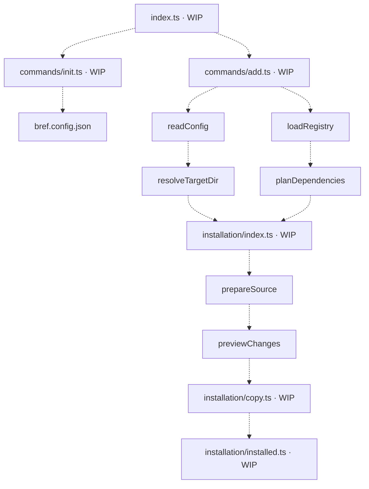

# Component CLI

The Bref CLI is being built to copy editable component source into a consumer project's
configured UI directory, using package types from `bref-ui/types`.

## Overview

This diagram shows the intended composition. Dashed arrows are wiring still to implement;
nodes marked WIP are placeholders. The named functions already exist as standalone stages.
The executable and commands are not connected yet, and CLI packaging is unfinished.



## Workflow documentation

| Directory                                | Workflows                                                | Status      |
| ---------------------------------------- | -------------------------------------------------------- | ----------- |
| [config](config/README.md)               | Read configuration; resolve the destination alias        | Implemented |
| [registry](registry/README.md)           | Plan dependencies                                        | Implemented |
| [registry/load](registry/load/README.md) | Discover and validate manifests and dependencies         | Implemented |
| [installation](installation/README.md)   | Prepare sources; preview changes                         | Implemented |
| [installation](installation/README.md)   | Coordinate installation; copy files; maintain exports    | WIP         |
| [commands](commands/README.md)           | Route commands; initialize configuration; add components | WIP         |

## Source layout

```text
cli/
  index.ts
  tsconfig.json
  config/
    read.ts
    resolve.ts
    types.ts
    schema.json
  registry/
    types.ts
    load/
      index.ts
      utils.ts
    plan.ts
  installation/
    index.ts
    types.ts
    prepare.ts
    preview.ts
    copy.ts
    installed.ts
  commands/
    init.ts
    add.ts
```

Single-file stages use named files. Stages with supporting files use a folder whose
`index.ts` is the sole public entry. Each functional module exposes one public function;
helpers and types stay within their responsibility. See [CLI contribution rules](AGENTS.md).
