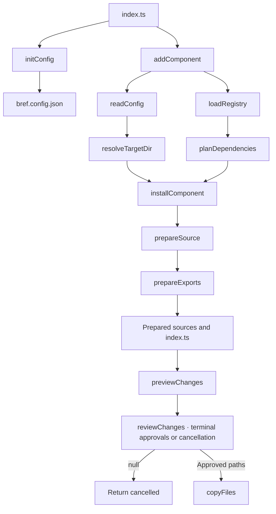

# Component CLI

The Bref CLI is being built to copy editable component source into a consumer project's
configured UI directory, using package types from `bref-ui/types`.

## Overview

The executable routes init and add to the implemented stages and ships in the local package.
Automatic project alias discovery remains unfinished. Bun is required to run the CLI.
Run commands from the consumer project directory:

```sh
bun run bref-ui init
bun run bref-ui add button
```

Install the local tarball with `bun add /path/to/bref-ui-2.0.0.tgz`. The executable loads
the canonical registry shipped in the package; copied components use its `bref-ui/types`
entry. Use `bun run bref-ui --help` for usage. Direct source invocation remains available
with `bun /path/to/bref-ui/cli/index.ts <command>`.

`bun pm pack --destination .workbench/artifacts` validates manifests through `loadRegistry`,
builds the library and runs publint before producing a local tarball. The package ships
CLI TypeScript modules and canonical `src/lib` sources alongside `dist`. Import/export
parsing reuses `svelte/compiler`; the TypeScript compiler remains development-only and
is not installed for CLI consumers. Packing does not publish to npm.



## Workflow documentation

| Directory                                | Workflows                                                | Status      |
| ---------------------------------------- | -------------------------------------------------------- | ----------- |
| [config](config/README.md)               | Read configuration; resolve the destination alias        | Implemented |
| [registry](registry/README.md)           | Plan dependencies                                        | Implemented |
| [registry/load](registry/load/README.md) | Discover and validate manifests and dependencies         | Implemented |
| [installation](installation/README.md)   | Prepare sources and exports; preview changes; copy files | Implemented |
| [installation](installation/README.md)   | Coordinate installation                                  | Implemented |
| [commands](commands/README.md)           | Add components with terminal review                      | Implemented |
| [commands](commands/README.md)           | Initialize configuration                                 | Implemented |
| [commands](commands/README.md)           | Route commands                                           | Implemented |

## Source layout

```text
cli/
  index.ts
  pack.ts
  commands/
    index.ts
    execute.ts
    parse.ts
    types.ts
    add/
      index.ts
      approve-overwrites.ts
      display-changes.ts
      review-changes.ts
      utils.ts
    init.ts
  config/
    read/
      index.ts
      normalize-config.ts
      read-config-file.ts
    resolve/
      index.ts
      resolve-alias-target.ts
      resolve-alias.ts
    schema.json
    types.ts
  installation/
    index.ts
    copy/
      index.ts
      validate-overwrite-approvals.ts
      write-prepared-files.ts
    exports/
      index.ts
      collect-exports.ts
      create-additions.ts
      merge-content.ts
      read-declared-export-names.ts
      read-exported-names.ts
      read-index.ts
      read-reexported-names.ts
      types.ts
      utils.ts
    parser/
      index.ts
      types.ts
      utils.ts
    prepare/
      index.ts
      collect-source-files.ts
      read-source-files.ts
      rewrite-imports.ts
      rewrite-source.ts
      types.ts
    preview/
      index.ts
      compare-prepared-files.ts
      read-destination-files.ts
      types.ts
    types.ts
  registry/
    load/
      index.ts
      create-registry.ts
      discover-manifests.ts
      load-entry.ts
      utils.ts
      validate-dependencies.ts
    plan/
      index.ts
      collect-entries.ts
    types.ts
  tsconfig.json
```

Single-file stages use named files. Stages with supporting files use a folder whose
`index.ts` is the sole public entry. Each functional module exposes one public function.
An entry file contains only its orchestration function, calling named steps in sibling
files. General helpers live in the stage's `utils.ts`; types stay within their responsibility.
See [CLI contribution rules](AGENTS.md).
