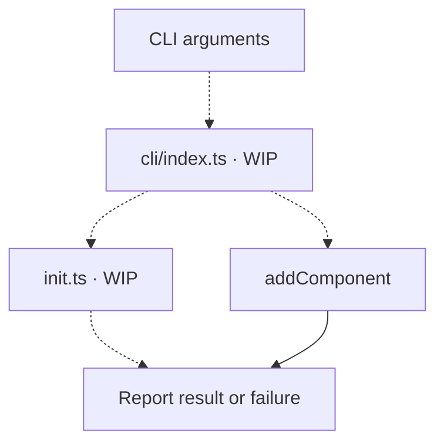
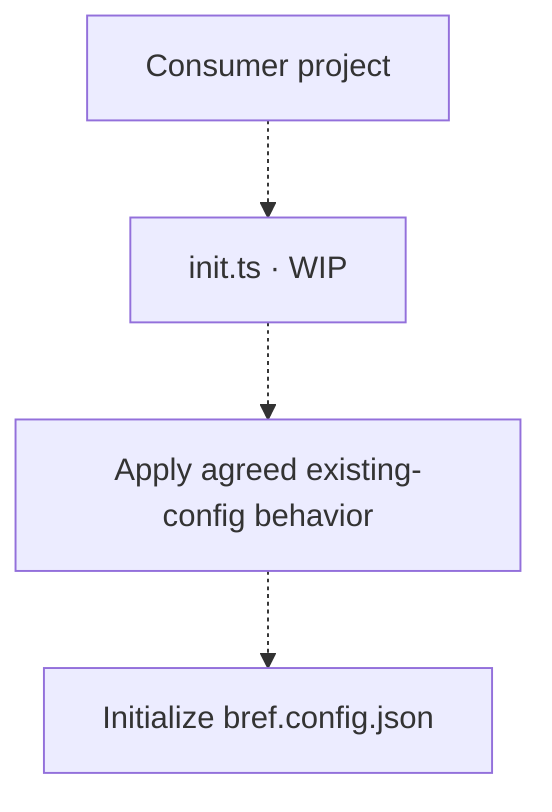
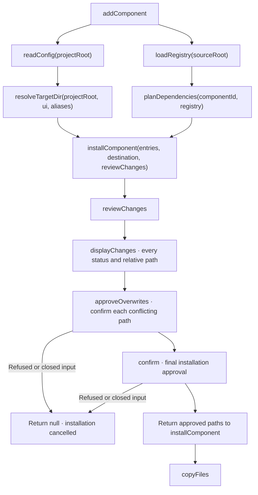

# Commands

[CLI overview](../README.md)

The add command is implemented. The executable and init command remain WIP;
invocation syntax and initialization behavior still need agreement.
Dashed arrows show proposed wiring.

## Route commands

[`cli/index.ts`](../index.ts) will route arguments and report command results and failures.

## Initialize configuration

[`init.ts`](init.ts) will initialize consumer project configuration. Handling existing
configuration files still requires agreed behavior.

## Add a component

[`addComponent`](add/index.ts) connects [configuration](../config/README.md),
[registry loading](../registry/load/README.md), [dependency planning](../registry/README.md)
and [installation](../installation/README.md). It accepts the component ID, consumer
project root, canonical source root and optional alias mappings, then returns
`installed` or `cancelled`. Errors propagate to the caller.

The consumer must already have `bref.config.json`. Alias discovery is deferred;
the caller supplies overrides for the default `$lib` mapping.

Confirmations use Bun's native `prompt`. Only `y` or `yes` accepts, ignoring case and
surrounding whitespace. Refusal, empty input or closed input at any prompt cancels
without writes; remaining prompts are skipped. `index.ts` needs its own approval
when its content changes. Accepted copying can fail partially; writes are not atomic.
