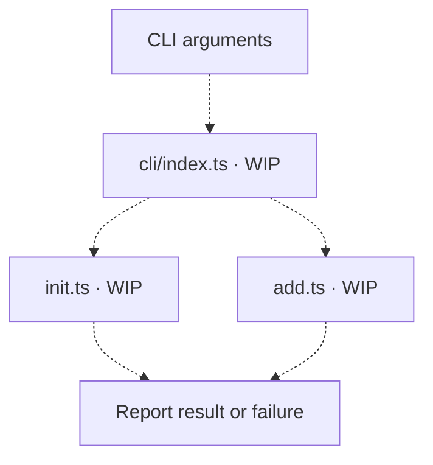
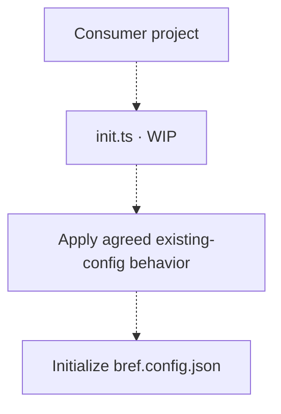
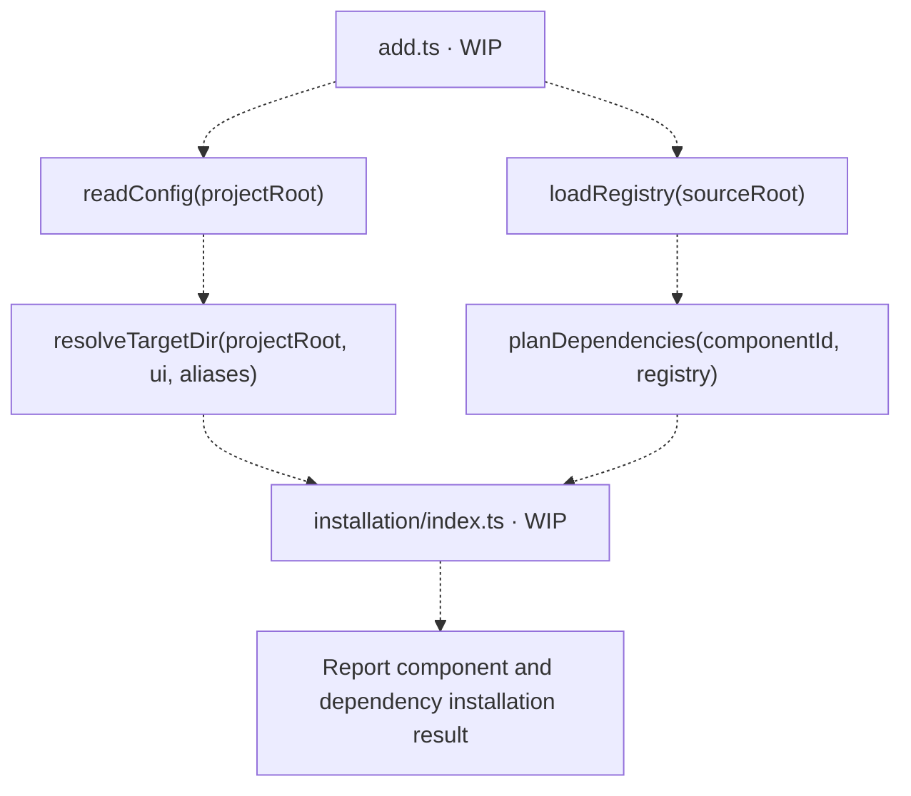

# Commands — WIP

[CLI overview](../README.md)

The executable and both commands contain only WIP comments. The diagrams below describe
intended responsibilities; invocation syntax, public function signatures and command
behavior remain unfinished. Dashed arrows show proposed wiring.

## Route commands

[`cli/index.ts`](../index.ts) will route arguments and report command results and failures.

## Initialize configuration

[`init.ts`](init.ts) will initialize consumer project configuration. Handling existing
configuration files still requires agreed behavior.

## Add a component

[`add.ts`](add.ts) will connect [configuration](../config/README.md),
[registry loading](../registry/load/README.md), [dependency planning](../registry/README.md)
and [installation](../installation/README.md), then report the outcome.

