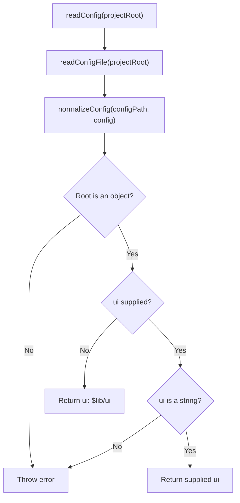
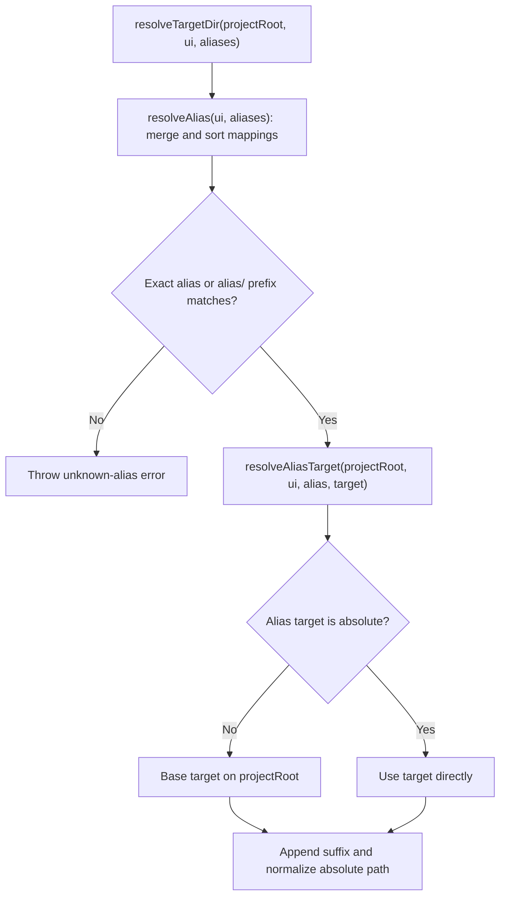

# Configuration

[CLI overview](../README.md) · [Configuration types](types.ts) · [JSON schema](schema.json)

## Read configuration

[`readConfig(projectRoot)`](read/index.ts) reads `bref.config.json` and returns `{ ui }`.
An omitted `ui` defaults to `$lib/ui`; a missing file is an error, not a default configuration.

Unreadable files and invalid JSON also reject the operation. Other configuration fields
are not returned.

## Resolve the destination

[`resolveTargetDir(projectRoot, ui, aliases?)`](resolve/index.ts) returns a normalized absolute
destination without accessing the filesystem. Supplied mappings override `$lib → src/lib`.

With defaults, `$lib/ui` resolves to `<projectRoot>/src/lib/ui`. Actual project alias
discovery is deferred; callers must supply overrides. The command connecting reading
and resolution remains WIP.
