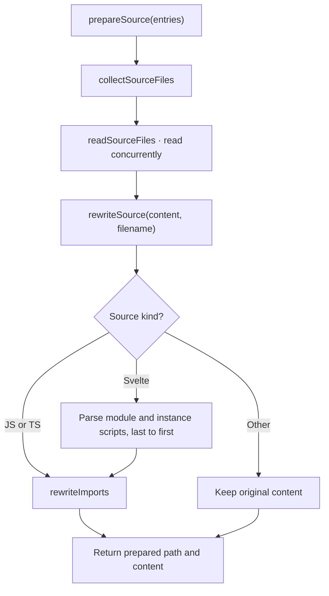
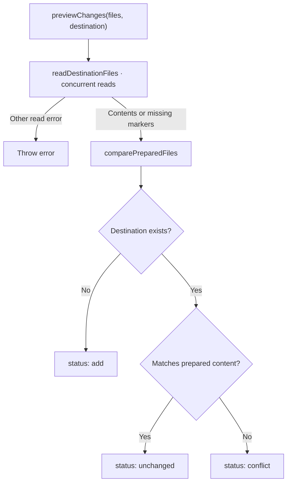
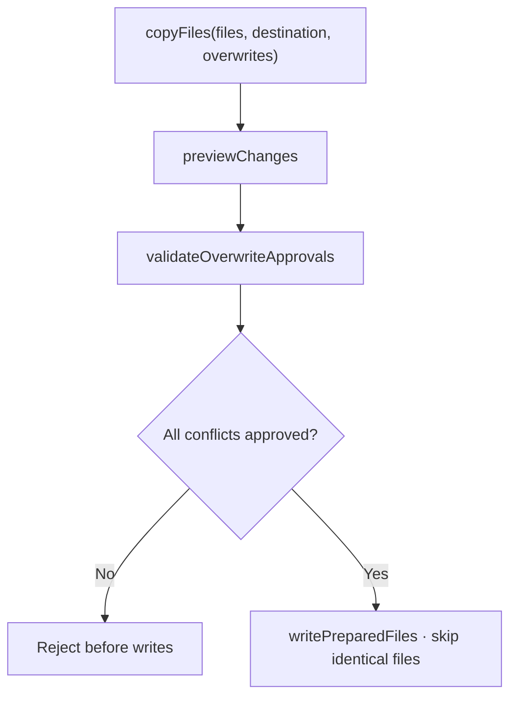
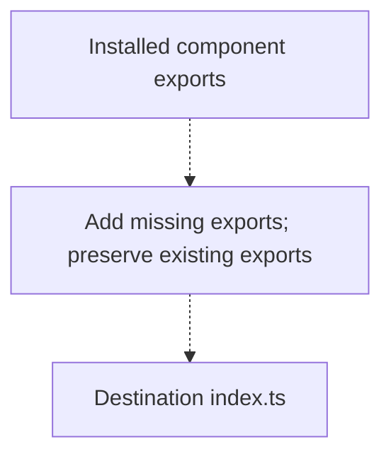
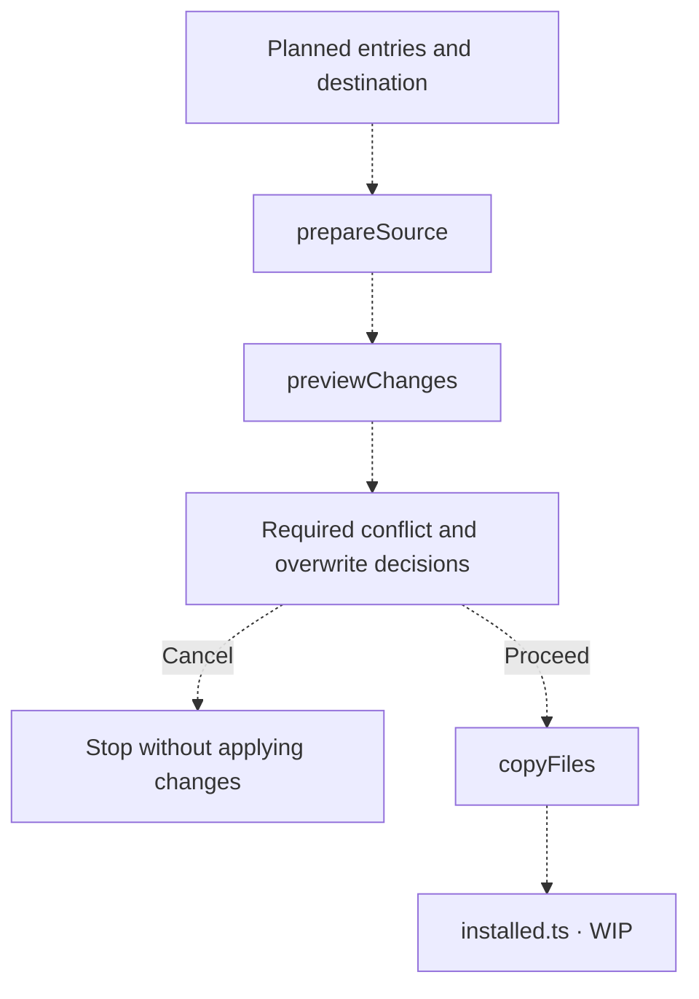

# Installation

[CLI overview](../README.md) · [Installation types](types.ts)

Preparation, preview and copying are implemented.
[`index.ts`](index.ts) and [`installed.ts`](installed.ts) remain WIP placeholders.

## Prepare source

[`prepareSource(entries)`](prepare/index.ts) reads planned files and returns `PreparedFile[]`
containing relative destination paths and source content. Paths retain source folder names;
file order follows entries and their manifests.



`rewriteImports` redirects relative, type-only imports to `bref-ui/types`, except imports
ending in `.svelte`. Runtime imports and non-relative imports remain unchanged. Relative
non-component imports mixing inline type and value specifiers are rejected. Script edits
preserve other text, including Svelte markup and CSS; read and parsing failures propagate.

## Preview changes

[`previewChanges(files, destination)`](preview/index.ts) compares prepared content with destination
files without writing. Results retain prepared-file order.



Preview reports statuses only; it does not request approval or perform copying.

## Stage layout

Each stage directory exposes one public orchestration function from `index.ts`;
its sibling files contain the internal steps and are not re-exported.

```text
installation/
  prepare/
    index.ts
    collect-source-files.ts
    read-source-files.ts
    rewrite-source.ts
    rewrite-imports.ts
    types.ts
  preview/
    index.ts
    read-destination-files.ts
    compare-prepared-files.ts
    types.ts
  copy/
    index.ts
    validate-overwrite-approvals.ts
    write-prepared-files.ts
  installed.ts
```

## Copy files

[`copyFiles(files, destination, overwrites)`](copy/index.ts) accepts explicit relative overwrite
paths, skips identical files and rejects unapproved conflicts before any writes. Bun writes
create missing directories. Checks and writes are not atomic; write failures may leave
some files copied. Cancellation must skip this call.



## Maintain installed exports — WIP

[`installed.ts`](installed.ts) is intended to add missing component exports to the destination
`index.ts`, without duplicating or replacing existing exports. Its API and implementation
are unfinished.



## Coordinate installation — WIP

[`index.ts`](index.ts) will coordinate these stages. Dashed arrows show proposed wiring;
approval and cancellation behavior are not implemented.


