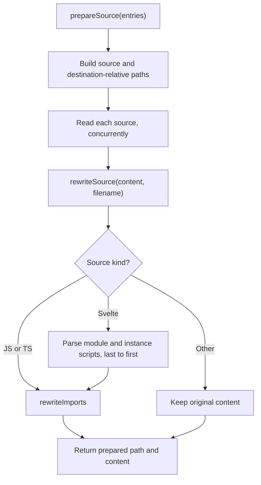
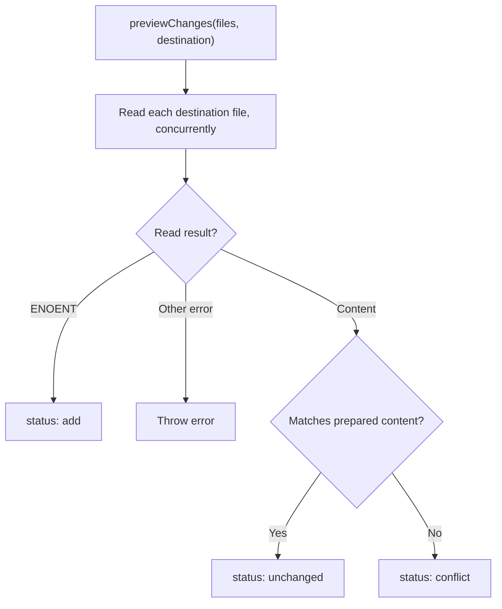
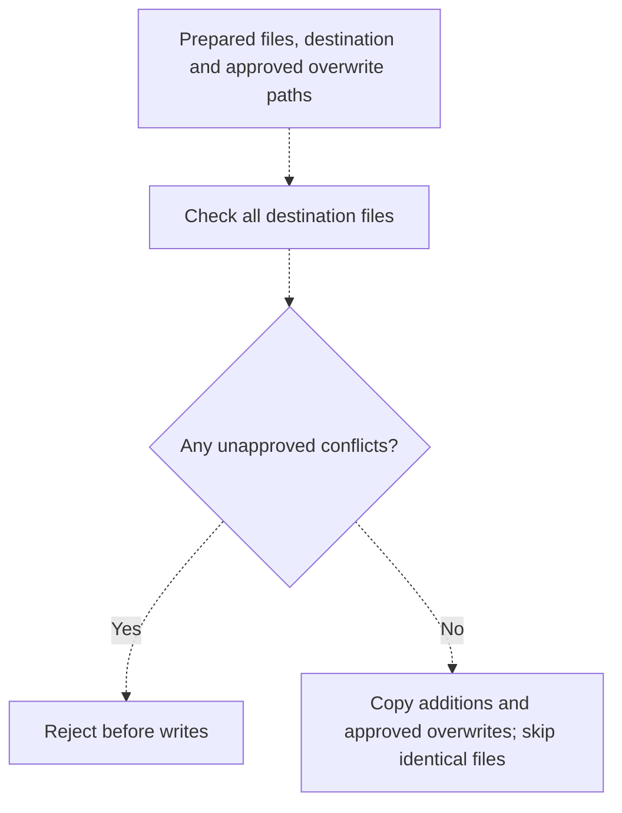
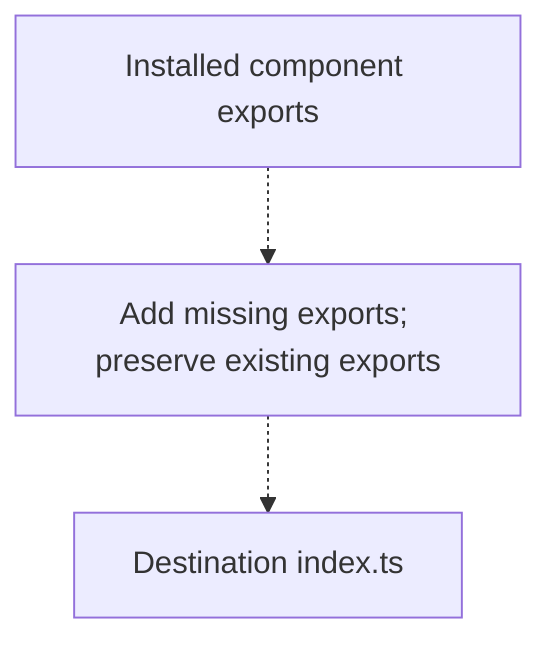
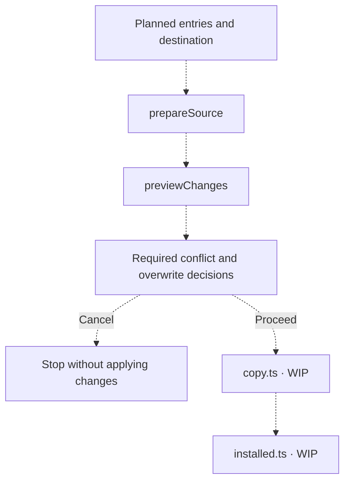

# Installation

[CLI overview](../README.md) · [Installation types](types.ts)

Preparation and preview are implemented. [`index.ts`](index.ts), [`copy.ts`](copy.ts) and
[`installed.ts`](installed.ts) remain WIP placeholders in this checkout.

## Prepare source

[`prepareSource(entries)`](prepare.ts) reads planned files and returns `PreparedFile[]`
containing relative destination paths and source content. Paths retain source folder names;
file order follows entries and their manifests.

`rewriteImports` redirects relative, type-only imports to `bref-ui/types`, except imports
ending in `.svelte`. Runtime imports and non-relative imports remain unchanged. Relative
non-component imports mixing inline type and value specifiers are rejected. Script edits
preserve other text, including Svelte markup and CSS; read and parsing failures propagate.

## Preview changes

[`previewChanges(files, destination)`](preview.ts) compares prepared content with destination
files without writing. Results retain prepared-file order.

Preview reports statuses only; it does not request approval or perform copying.

## Copy files — WIP

The separate copying task targets explicit approved overwrite paths, skipping identical
files and rejecting unapproved conflicts before any writes. This is the intended flow;
[`copy.ts`](copy.ts) has no function yet in this checkout.

## Maintain installed exports — WIP

[`installed.ts`](installed.ts) is intended to add missing component exports to the destination
`index.ts`, without duplicating or replacing existing exports. Its API and implementation
are unfinished.

## Coordinate installation — WIP

[`index.ts`](index.ts) will coordinate these stages. Dashed arrows show proposed wiring;
approval and cancellation behavior are not implemented.

