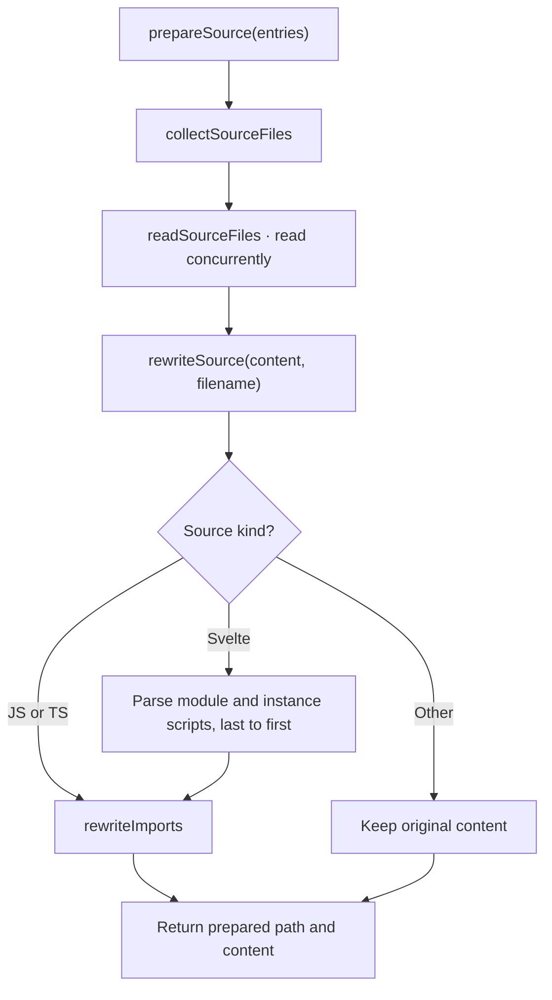
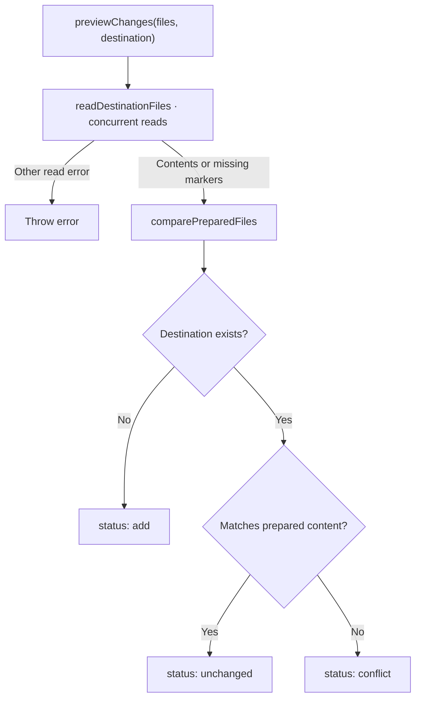
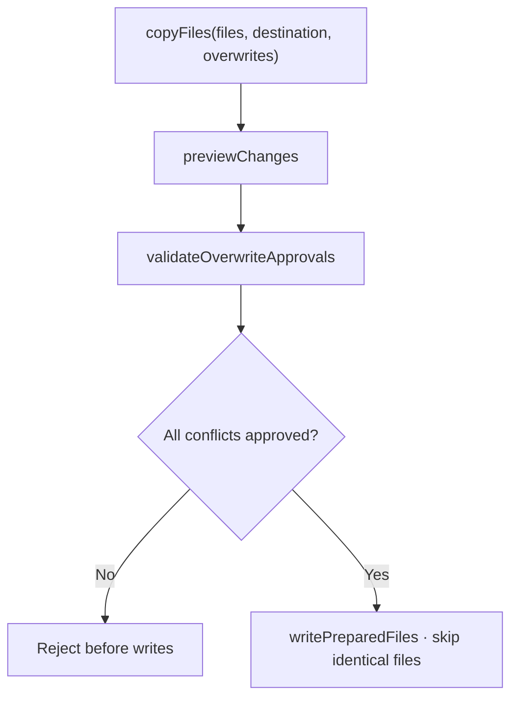
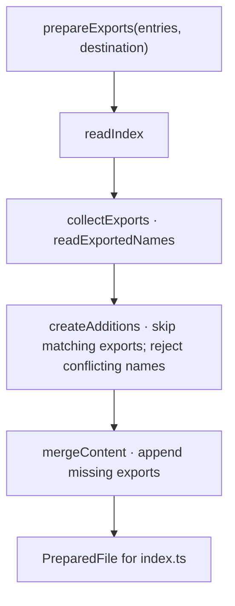
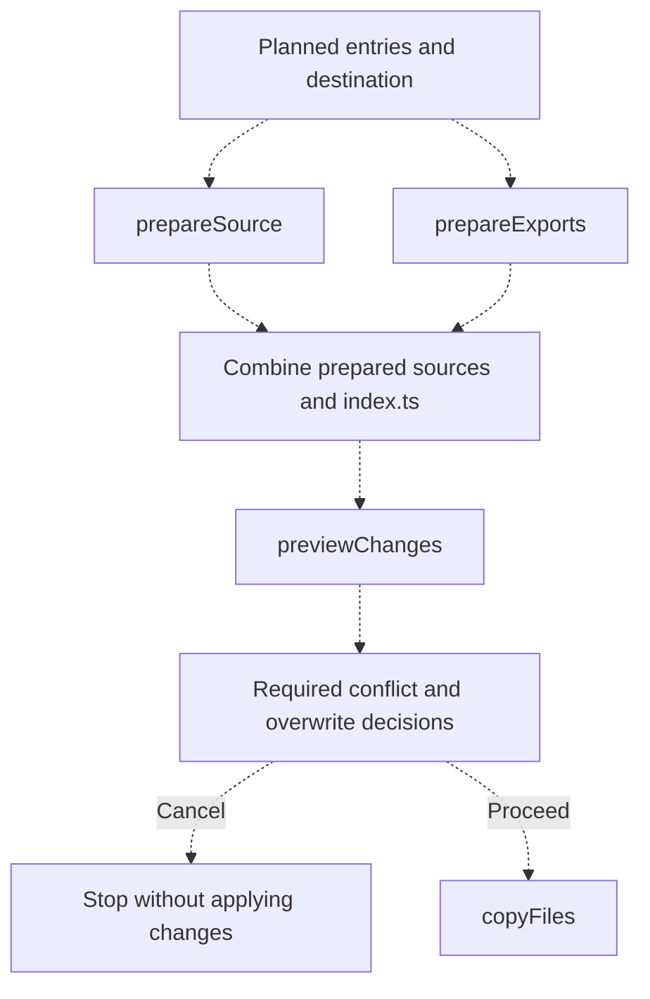

# Installation

[CLI overview](../README.md) · [Installation types](types.ts)

Preparation, preview, copying and installed export preparation are implemented.
[`index.ts`](index.ts) remains a WIP placeholder.

## Prepare source

[`prepareSource(entries)`](prepare/index.ts) reads planned files and returns `PreparedFile[]`
containing relative destination paths and source content. Paths retain source folder names;
file order follows entries and their manifests.



`rewriteImports` redirects relative, type-only imports to `bref-ui/types`, except imports
ending in `.svelte`. Runtime imports and non-relative imports remain unchanged. Relative
non-component imports mixing inline type and value specifiers are rejected. Script edits
preserve other text, including Svelte markup and CSS; read and parsing failures propagate.

## Preview changes

[`previewChanges(files, destination)`](preview/index.ts) compares prepared content with destination
files without writing. Results retain prepared-file order.



Preview reports statuses only; it does not request approval or perform copying.

## Stage layout

Each stage directory exposes one public orchestration function from `index.ts`;
its sibling files contain the internal steps and are not re-exported.

```text
installation/
  prepare/
    index.ts
    collect-source-files.ts
    read-source-files.ts
    rewrite-source.ts
    rewrite-imports.ts
    types.ts
  preview/
    index.ts
    read-destination-files.ts
    compare-prepared-files.ts
    types.ts
  copy/
    index.ts
    validate-overwrite-approvals.ts
    write-prepared-files.ts
  exports/
    index.ts
    read-index.ts
    collect-exports.ts
    create-additions.ts
    merge-content.ts
    read-exported-names.ts
    read-reexported-names.ts
    read-declared-export-names.ts
    types.ts
    utils.ts
```

## Copy files

[`copyFiles(files, destination, overwrites)`](copy/index.ts) accepts explicit relative overwrite
paths, skips identical files and rejects unapproved conflicts before any writes. Bun writes
create missing directories. Checks and writes are not atomic; write failures may leave
some files copied. Cancellation must skip this call.



## Prepare exports

[`prepareExports(entries, destination)`](exports/index.ts) returns a prepared `index.ts` without
writing. It preserves existing text, skips matching direct default re-exports and appends
missing component exports using the source folder names retained by `prepareSource`.
New lines follow the existing LF or CRLF style.

The stage's sole public entry is `exports/index.ts`, containing only `prepareExports`.
It calls the sibling `read-index.ts`, `collect-exports.ts`, `create-additions.ts` and
`merge-content.ts` steps. `readExportedNames` dispatches to sibling readers for export
lists and exported declarations. Results use named `name` and `componentPath` fields:
a path identifies a reusable default re-export; null marks a name occupied by another
export. Default re-export path checks and destructuring helpers live in `exports/utils.ts`.

Other exports using a requested name cause a conflict. Wildcard re-exports are rejected
because their names cannot be determined from this file alone. Syntax and read errors
propagate; only ENOENT means an empty index. The returned file joins prepared sources
before preview and copying, so index overwrites require approval too.



## Coordinate installation — WIP

[`index.ts`](index.ts) will coordinate these stages. Dashed arrows show proposed wiring;
approval and cancellation behavior are not implemented.


