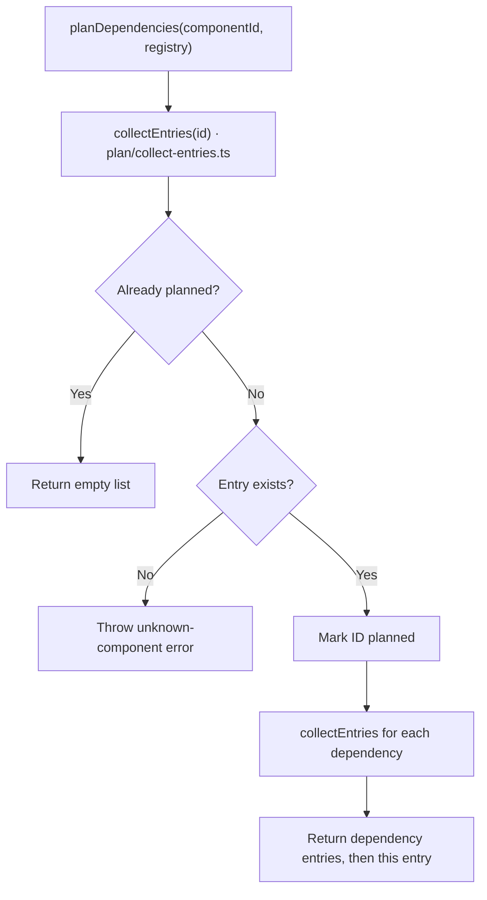

# Registry

[CLI overview](../README.md) · [Registry types](types.ts) · [Loading workflow](load/README.md)

[`loadRegistry`](load/index.ts) returns a validated `Map<string, RegistryEntry>`. Each entry
contains its manifest's `id`, relative `files`, component `exports`, `dependencies` and
the containing source `directory`.

## Plan dependencies

[`planDependencies(componentId, registry)`](plan/index.ts) returns unique entries in dependency-first
order, preserving declared dependency order. It reads no files and writes no changes.

The planner expects the validated catalogue from `loadRegistry`; cycle rejection belongs
to loading. It also rejects missing IDs encountered during traversal. The returned entries
feed [source preparation](../installation/README.md).
