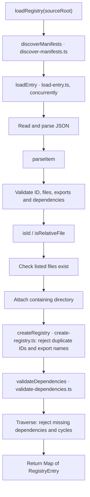

# Registry loading

[Registry overview](../README.md) · [Entry point](index.ts) · [Metadata helpers](utils.ts)

`loadRegistry(sourceRoot)` scans immediate component folders for `registry.json`, returning
entries keyed by component ID in sorted manifest-path order. Loading writes no files.

`parseItem` validates required fields, unique file and dependency lists, and PascalCase
exports pointing to listed files. File paths must be relative, without empty, dot or parent
segments, backslashes or colons. These checks are lexical; symlinks are not resolved.

`validateDependencies` recursively visits each entry. An active-chain set detects cycles;
a completed set skips previously validated chains. Any read, metadata, file, uniqueness or
dependency failure rejects loading.

`utils.ts` exports `parseItem` only for internal use by the stage. The entry file calls the
four sibling steps; external callers use `load/index.ts`.
